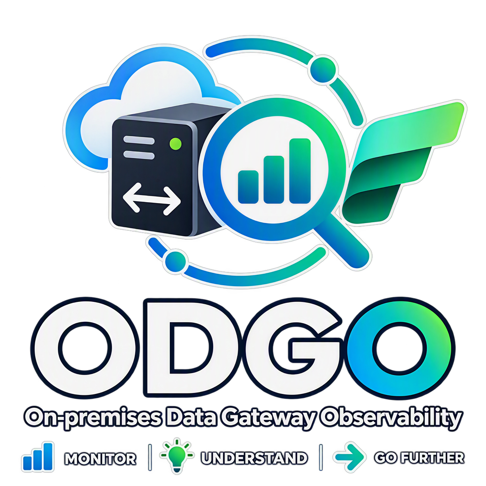

<p align="center">
  
</p>

<h1 align="center">On-premises Data Gateway Observability (ODGO)</h1>

<p align="center">
  <strong>ODGO is a centralized observability solution for Microsoft On-premises data gateways, using Microsoft Fabric
  and OneLake for cost-conscious, long-term monitoring and historical analysis.</strong>
</p>

<p align="center">
  <a href="LICENSE"></a>
</p>

> [!CAUTION]
> This solution accelerator is not an official Microsoft product! It is a solution accelerator, which can help you implement a monitoring solution within Fabric. As such there is no official support available and there is a risk that things might break.

**Contents:**
[Overview](#overview) ·
[Getting started](#getting-started) ·
[Architecture](#architecture) ·
[What is collected](#what-is-collected) ·
[Monitoring solution landscape](#monitoring-solution-landscape) ·
[Limitations](#limitations) ·
[Security and privacy](#security-and-privacy) ·
[Documentation](#documentation) ·
[Contributing](#contributing) ·
[Credits](#credits-and-acknowledgements) ·
[License](#license)

## Overview

On-premises data gateways connect Power BI, Microsoft Fabric, Power Apps and Power Automate to data behind a
firewall. When refreshes slow down or fail, the answers are in the gateway's own log files: query durations, errors,
data sources, mashup engine activity, CPU and memory counters. But those files stay on each gateway server, rotate
after a limited number of files and have to be collected by hand from every node of every cluster.

ODGO collects them continuously from every gateway server into **OneLake**, keeps them as Delta tables in a
**Fabric lakehouse** (Bronze, Silver and Gold layers) and serves them to Power BI through a **Direct Lake** semantic
model. You get one place to answer questions such as *which data source fails most often*, *which node is
overloaded* or *did the last gateway update change query durations*, with months of history to spot trends long
after the gateways have rotated their own files.

| | |
|---|---|
| **Supported** | Microsoft **On-premises data gateway** in standard mode, on Windows servers. Clusters spread over several servers |
| **Not in scope** | **VNet data gateways** (a Microsoft-managed service: there is no server to install the agent on) and personal-mode gateways |
| **Not collected** | Service-side data such as Power BI refresh history, Fabric capacity metrics or audit logs: ODGO only reads the files that the gateway writes on its servers |

What's in the box:

| Component | What it does |
|---|---|
| Collection agent ([gateway-agent/](gateway-agent/)) | PowerShell 7 scheduled task, every 15 minutes. Uploads only new, complete records of 12 gateway log types (11 on by default). Crash-safe and idempotent: re-running never duplicates data |
| Setup notebook ([fabric/ODGO_Setup.ipynb](fabric/ODGO_Setup.ipynb)) | Imported and run once in a Fabric workspace: creates or upgrades every Fabric item and prints the agent install command |
| Processing ([fabric/notebooks/](fabric/notebooks/)) | `nb_gwmon_ingest` builds the Bronze, Silver and Gold tables every 6 hours: it checks every upload, quarantines invalid files, redacts secrets and captures unknown columns. `nb_gwmon_maintenance` applies the retention and compacts the tables once a day |
| Semantic model and reports ([powerbi/](powerbi/)) | *ODGO Model*, a Direct Lake semantic model, and two reports on it: *ODGO - Gateway Observability*, which opens on a home page with the analysis paths, and *Gateway Monitor*, with the pages of the original [pbigtwmonitor](https://github.com/RuiRomano/pbigtwmonitor) report. Both have an *Ingestion Health* page with the upload status of each server |

## Getting started

You need a Fabric workspace on a capacity (F SKU or trial) and PowerShell 7 (MSI package) on the gateway servers. The
full guide, with prerequisites and tenant settings, is [docs/setup.md](docs/setup.md).

1. **Create an identity for the agents:** a Microsoft Entra app registration with a client secret; copy its
   Application (client) ID. On Azure VMs and Azure Arc-enabled servers you can use the server's managed identity
   instead.
2. **Give it access to the workspace, before the next step:** in the workspace, select **Manage access** > **Add
   people or groups**, type the name of the app registration and give it the **Contributor** role.
3. **Set up Fabric:** import [fabric/ODGO_Setup.ipynb](fabric/ODGO_Setup.ipynb) into the workspace (**Import** >
   **Notebook**) and select **Run all**. In a minute or two, the notebook creates the lakehouse, notebooks, schedules,
   semantic model and reports, starts the first ingestion in the background, then prints the install command with the
   IDs of the workspace, the lakehouse and your tenant.
4. **Install the agent on each gateway server:** paste the printed lines into PowerShell run as administrator, after
   replacing `<client-id>` with the Application (client) ID of the app registration:

   ```powershell
   Set-Location $env:TEMP
   Invoke-WebRequest 'https://github.com/Pulsweb/ODGO/archive/refs/heads/main.zip' -OutFile odgo.zip -UseBasicParsing
   Remove-Item odgo -Recurse -Force -ErrorAction Ignore; Expand-Archive odgo.zip odgo
   $installer = (Get-ChildItem odgo -Recurse -Filter Install-Agent.ps1 | Select-Object -First 1).FullName
   pwsh -NoProfile -File $installer -InstallPath "$env:ProgramFiles\ODGO" -WorkspaceId <workspace-id> -LakehouseId <lakehouse-id> -TenantId <tenant-id> -ClientId <client-id>
   ```

   The installer creates the `-InstallPath` folder (change it to install elsewhere, for example `D:\ODGO`), which
   holds the agent, its configuration, state and logs. It asks for the client secret, stores it encrypted, registers
   the scheduled task and tests the connection to OneLake.

Open the *ODGO - Gateway Observability* report: each server appears on the *Ingestion Health* page once
`nb_gwmon_ingest` has processed its first upload. It runs every 6 hours; run it yourself in the workspace to see the
data sooner. To upgrade, see [docs/setup.md](docs/setup.md#upgrade).

## Architecture


## What is collected

| Log type | Gateway files | Default |
|---|---|---|
| `gateway-info`, `gateway-errors` | `GatewayInfo*.log`, `GatewayError*.log` (trace logs) | On |
| `gateway-network` | `GatewayNetwork*.log` | Off |
| `mashup`, `mashup-container-profiles` | `Mashup*.log`, `MashupContainerProfiles*.log` | On |
| `query-start-report`, `query-execution-report`, `query-execution-aggregation-report`, `system-counter-aggregation-report` | [Performance logging](https://learn.microsoft.com/data-integration/gateway/service-gateway-performance) reports in `Report\` | On |
| `gateway-properties`, `gateway-clusters`, `gateway-configuration` | `GatewayProperties.txt`, `GatewayClusters.txt`, `*ConfigurationProperties.json` (snapshots) | On |

The agent also sends a metadata snapshot (gateway and cluster IDs and names, gateway version and service status,
server name, FQDN, cores, memory, operating system, time zone) and run telemetry (counts, status, issues, agent
version).

The reports cover query trends (counts, durations and failures by gateway, data source and query type), requests
with drillthrough to single queries, query concurrency, logs with full-text search, mashup engine activity, CPU and
memory counters, the gateway inventory and the health of the collection itself. By default, the reports show 180 days,
Silver keeps 400 days, Bronze and the raw files 30 days ([docs/configuration.md](docs/configuration.md)). The tables
are described in [docs/data-model.md](docs/data-model.md).

## Monitoring solution landscape

Several approaches exist for monitoring on-premises data gateways. They answer different needs and can be used
together.

| | [Microsoft gateway performance monitoring](https://learn.microsoft.com/data-integration/gateway/service-gateway-performance) | [pbigtwmonitor](https://github.com/RuiRomano/pbigtwmonitor) | [Fabric Platform Monitoring](https://github.com/microsoft/fabric-toolbox/tree/main/monitoring/fabric-platform-monitoring) | **ODGO** (this repository) |
|---|---|---|---|---|
| **Scope** | Performance logs of one gateway, read locally by a Power BI template (`.pbit`) | Logs and reports of several gateway clusters, centralized | The whole Fabric platform (capacity, activity, inventory), with an on-premises data gateway module, centralized | Logs, performance reports and metadata of on-premises data gateways, and the health of their collection, centralized |
| **Real time** | No | No: scripts scheduled hourly or daily | Yes: gateway heartbeat and reports streamed through Eventstreams | No: agent every 15 minutes, processing every 6 hours by default |
| **History** | The files that the gateway keeps (10 of each kind by default) | Yes | Yes | Yes, with a retention per layer |
| **Storage and analysis** | Gateway log folder and a Power BI template | Azure Data Lake Storage Gen2 and an import model (predates Fabric) | Eventhouse and Real-Time Dashboard; log files also kept in a lakehouse | Lakehouse (Bronze, Silver and Gold Delta tables) and a Direct Lake semantic model |
| **Status** | Microsoft documentation; the feature is in public preview | **Archived**; its author recommends Fabric Platform Monitoring | Solution accelerator maintained in [microsoft/fabric-toolbox](https://github.com/microsoft/fabric-toolbox), not an official Microsoft product | New community project |

Microsoft's template analyzes one gateway quickly. pbigtwmonitor is the historical community reference for
centralized gateway log analysis; ODGO reuses its semantic model and report. Fabric Platform Monitoring covers
near-real-time monitoring of the whole platform, while ODGO focuses on the long-term analysis of gateway logs: both can
run side by side.

*Sources: the linked Microsoft Learn page and the README files of pbigtwmonitor and Fabric Platform Monitoring,
checked in October 2026.*

## Limitations

* **Not real time.** Data arrives in scheduled batches, processed every 6 hours by default. Use Fabric Platform
  Monitoring for near-real-time operational monitoring.
* **Gateway-side data only**, and history starts at installation: only logs still on the servers can be backfilled.
* **Undocumented log formats.** Microsoft doesn't formally document the gateway log formats, which can change with
  gateway updates. The parsers follow the formats handled by pbigtwmonitor and are tested against synthetic samples;
  unknown columns are captured as schema drift.
* **Fabric capacity required.** Consumption hasn't been measured; watch it with the
  [Capacity Metrics app](https://learn.microsoft.com/fabric/enterprise/metrics-app).
* **Direct Lake guardrails apply.** Direct Lake on OneLake doesn't fall back to DirectQuery, so the per-SKU
  [guardrails](https://learn.microsoft.com/fabric/fundamentals/direct-lake-overview#fabric-capacity-requirements)
  are hard limits. The daily maintenance keeps file counts down.
* **Report constraints.** The *Logs* page of each report uses the AppSource *Text Filter* visual, which your tenant
  must allow. Query concurrency is analyzed for one gateway at a time, as in the original report. There's no
  row-level security.
* **Manual steps remain:** the tenant settings, the app registration and the agent installation on each server.

## Security and privacy

* **What is collected.** Gateway logs can contain query text, data source names and paths, workspace and dataset
  IDs, account names that appear in log messages, and error details, plus the server metadata listed above.
* **Where it's stored.** Only in your Fabric workspace: raw copies in the lakehouse files (removed after 30 days by
  default) and processed data in the lakehouse tables. Silver masks connection-string secrets and bearer tokens with
  regex rules, and you can add rules. Nothing is sent anywhere else.
* **Permissions.** The agent identity is a Contributor of the workspace, so it can also read the processed data: use
  a workspace dedicated to ODGO. Report readers need the Viewer role and read access to the lakehouse data, unless
  you bind the model to a fixed identity ([docs/setup.md](docs/setup.md#share-the-reports)).
* **Secrets.** The client secret is typed on each server, never written to a configuration file and stored
  encrypted with DPAPI in a folder that only SYSTEM and Administrators can open. Prefer a managed identity on Azure
  VMs and Azure Arc-enabled servers. The repository contains no secret, and `.gitignore` excludes secret files.
* **Your responsibility.** You deploy ODGO in your own tenant. Securing the workspace, the app registration and the
  gateway servers, and complying with your organization's data policies, remain your responsibility.

Don't report security vulnerabilities in public issues: use **Report a vulnerability** in the repository's
**Security** tab.

## Documentation

| Topic | Document |
|---|---|
| Installation, upgrade, sharing the reports, security notes | [docs/setup.md](docs/setup.md) |
| Every setting: setup notebook, agent, processing | [docs/configuration.md](docs/configuration.md) |
| Monitoring, agent tasks, backfill, retention, troubleshooting | [docs/operations.md](docs/operations.md) |
| Lakehouse tables and semantic model (generated) | [docs/data-model.md](docs/data-model.md) |
| How to contribute | [CONTRIBUTING.md](CONTRIBUTING.md) |

> [!NOTE]
> Some technical names keep the prefix of the first version of the code base: the Fabric items `nb_gwmon_*` and
> `lh_gateway_monitor`, the OneLake folder `Files/gateway-monitor` and the *Gateway Monitor* report (the original
> pbigtwmonitor name).

## Contributing

Contributions are welcome: bug fixes, support for new log formats, report improvements and documentation. Read
[CONTRIBUTING.md](CONTRIBUTING.md) before opening a pull request.

Use [GitHub Issues](https://github.com/Pulsweb/ODGO/issues) for bugs and ideas. Never attach real
gateway logs, tenant or workspace IDs, tokens or secrets.

## Credits and acknowledgements

ODGO stands on the shoulders of earlier community work.

* **[Rui Romano](https://www.linkedin.com/in/ruiromano/) — [pbigtwmonitor](https://github.com/RuiRomano/pbigtwmonitor).** The community's reference solution
  for centralized gateway log analysis, now archived. ODGO directly reuses its semantic model (tables, columns,
  measures, relationships) and its report (pages, visuals, formatting, base theme), and its knowledge of the gateway
  log formats, reimplemented in Python. pbigtwmonitor is MIT-licensed; its notice is kept in [NOTICE.md](NOTICE.md).
* **[Edgar Cotte](https://www.linkedin.com/in/edgarcotte/) ([@ecotte](https://github.com/ecotte)) and the contributors of
  [Fabric Platform Monitoring](https://github.com/microsoft/fabric-toolbox/tree/main/monitoring/fabric-platform-monitoring)**
  in the [Microsoft Fabric Toolbox](https://github.com/microsoft/fabric-toolbox). It brings gateway telemetry into
  Microsoft Fabric with scripts on each gateway node, including heartbeat-style monitoring, and is one of the major
  inspirations for ODGO, which applies similar ideas in a batch, lakehouse and Direct Lake form. No code from Fabric
  Platform Monitoring is included in this repository.
* **The FUAM team, [Kevin Thomas](https://www.linkedin.com/in/kevin-thomas-021156244/) and
  [Gellért Gintli](https://www.linkedin.com/in/ggintli/) — [Fabric Unified Admin Monitoring (FUAM)](https://github.com/microsoft/fabric-toolbox/tree/main/monitoring/fabric-unified-admin-monitoring).**
  FUAM, also in the Microsoft Fabric Toolbox, is an inspiration for ODGO: its *FUAM Gateway Monitoring From Files*
  report inspired the layout of the *ODGO - Gateway Observability* report (logo and page tabs in a header, a filter
  panel on each page, a home page with the analysis paths). No code or asset from FUAM is included in this repository.
* **Microsoft documentation:** [gateway performance monitoring](https://learn.microsoft.com/data-integration/gateway/service-gateway-performance),
  [gateway log files](https://learn.microsoft.com/data-integration/gateway/service-gateway-log-files) and the
  [Microsoft Fabric documentation](https://learn.microsoft.com/fabric/).
* Community articles about gateway monitoring, such as the *On-premises data gateway monitoring series* linked from the
  *Counters* page of the *Gateway Monitor* report.

## License

ODGO is released under the [MIT License](LICENSE). It includes material derived from pbigtwmonitor (MIT, © Rui Romano)
and a Power BI base theme. Attributions are in [NOTICE.md](NOTICE.md).

ODGO is a community solution accelerator. It isn't an official Microsoft product, isn't affiliated with or endorsed by
Microsoft, and comes with no official support. It is provided "as is" under the MIT License, without warranty of any
kind. Test it in a non-production environment before relying on it.

Microsoft, Microsoft Fabric, Power BI, OneLake, Azure and Microsoft Entra are trademarks of the Microsoft group of
companies.
