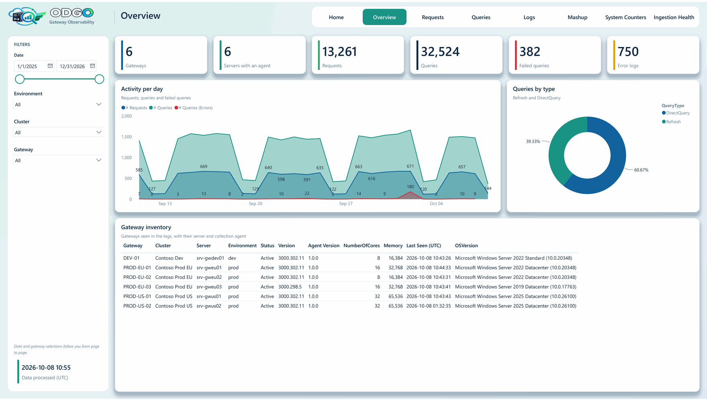
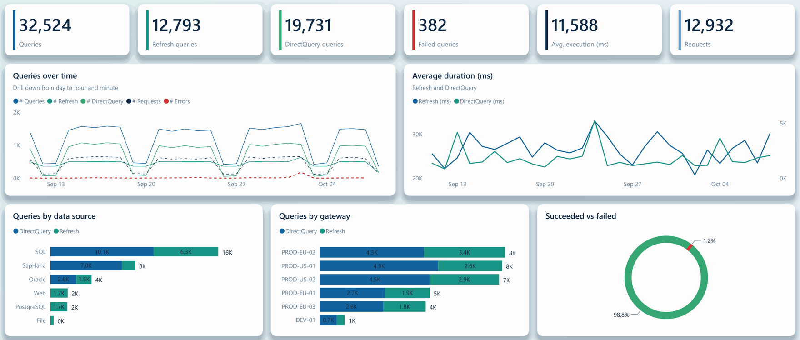
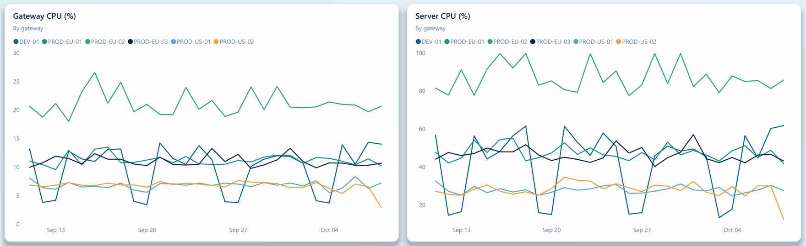
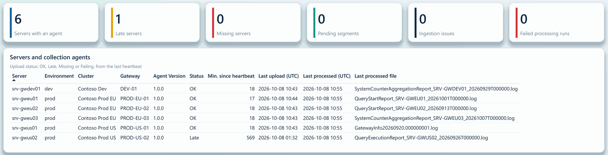
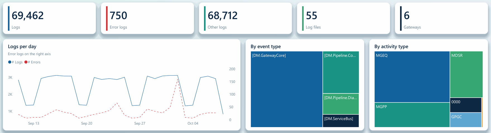

  

<h1 align="center">On-premises Data Gateway Observability (ODGO)</h1>

  <strong>ODGO is a centralized observability solution for Microsoft On-premises data gateways, using Microsoft Fabric
  and OneLake for cost-conscious, long-term monitoring and historical analysis.</strong>

  

The <em>Overview</em> page of the ODGO report. All the screenshots use fictitious demo data.

> [!CAUTION]
> This solution accelerator is not an official Microsoft product! It is a solution accelerator, which can help you implement a monitoring solution within Fabric. As such there is no official support available and there is a risk that things might break.

**Contents:**
[Why ODGO](#why-odgo) ·
[See it in action](#see-it-in-action) ·
[Get started](#get-started) ·
[How it works](#how-it-works) ·
[What is collected](#what-is-collected) ·
[Monitoring solution landscape](#monitoring-solution-landscape) ·
[Limitations](#limitations) ·
[Security and privacy](#security-and-privacy) ·
[Contributing](#contributing) ·
[Credits](#credits-and-acknowledgements) ·
[License](#license)

## Why ODGO

On-premises data gateways connect Power BI, Microsoft Fabric, Power Apps and Power Automate to data behind a
firewall. When refreshes slow down or fail, the answers are in the gateway's own log files: query durations, errors,
data sources, mashup engine activity, CPU and memory counters. But those files stay on each gateway server, rotate
after a limited number of files and have to be collected by hand from every node of every cluster.

ODGO collects them continuously from every gateway server into **OneLake**, keeps them as Delta tables in a **Fabric
lakehouse** and serves them to a ready-made **Power BI report** through a **Direct Lake** semantic model:

* **One report for all your gateways.** Requests, queries, errors, logs, mashup engine activity and CPU and memory
  counters of every node of every cluster, down to a single query.
* **Months of history.** Spot trends and compare before and after a gateway update, long after the gateways have
  rotated their own files.
* **Know when the collection stops.** The agent of each server reports every 15 minutes, and the report flags the
  servers that go silent.
* **Nothing to install on the gateway servers.** The agent is a scheduled task that runs with the Windows PowerShell
  built into Windows, and uploads only new, complete records.
* **Your data stays in your tenant.** Everything runs in your own Fabric workspace, and the connection-string secrets
  and tokens found in the logs are masked.
* **One notebook to deploy and upgrade.** The setup notebook creates or updates every Fabric item and prints the
  command that installs the agent.

ODGO works with the **On-premises data gateway in standard mode** on Windows servers, including clusters spread over
several servers. VNet data gateways and personal-mode gateways are out of scope ([details](#what-is-collected)).

## See it in action

The report opens on a home page with the analysis paths, followed by seven pages: *Overview*, *Requests*, *Queries*,
*Logs*, *Mashup*, *System Counters* and *Ingestion Health*. Here are four of them, with fictitious data from six
gateways in three clusters.

**Find the slow and failing data sources.** Query volumes, durations and failures per day, per data source and per
gateway, for refreshes and DirectQuery. Right-click a query to open its details.

**Spot the overloaded node.** CPU and memory of each gateway and of its server, per day or for each interval that the
gateway reports. Here, PROD-EU-02 peaks at 75 to 100% CPU every day, while the other nodes of its cluster stay below
60%.

**Know when a server stops sending its logs.** The *Ingestion Health* page shows the last heartbeat and upload of the
agent of each server, and by default flags a server *Late* after 8 hours of silence and *Missing* after 24 hours.
Here, the agent of PROD-US-02 has been silent for more than 9 hours.

**Investigate errors across every gateway.** Gateway logs per day, by event type and by activity type, with a
full-text search on the messages. Here, the spike of errors comes from an expired data source password.

## Get started

You deploy ODGO from Fabric with one notebook, then install the agent on each gateway server with one PowerShell
command. It takes about 15 minutes for the first server, mostly copy and paste. The [setup guide](docs/setup.md)
details each step.

### 1. Create an identity for the agents

In the [Microsoft Entra admin center](https://entra.microsoft.com), create an **app registration** and a **client
secret**. Copy the *Application (client) ID* and the secret *Value*. On Azure VMs and Azure Arc-enabled servers, you
can use the server's managed identity instead.
[Details](docs/setup.md#1-create-an-identity-for-the-agents)

### 2. Give it access to the workspace

In the Fabric workspace, select **Manage access** > **Add people or groups**, type the name of the app registration
and give it the **Contributor** role. Do it before step 3.
[Details](docs/setup.md#2-give-the-identity-access-to-the-workspace)

### 3. Deploy ODGO in Fabric

Download [fabric/ODGO_Setup.ipynb](fabric/ODGO_Setup.ipynb), import it into the workspace (**Import** > **Notebook** >
**From this computer**) and select **Run all**. In a minute or two, the notebook creates the lakehouse, the notebooks
and their schedules, the semantic model and the report, then prints the command that installs the agent.
[Details](docs/setup.md#3-run-the-setup-notebook)

### 4. Install the agent on each gateway server

Open PowerShell **as administrator** on the server and paste the lines printed by the notebook, after replacing
`<client-id>` with the Application (client) ID of step 1. Type the client secret when asked. The installer creates a
scheduled task that uploads the new log records every 15 minutes, then tests the whole chain: every check should
show *PASS*.
[Details](docs/setup.md#4-install-the-agent-on-each-gateway-server)

### 5. Open the report

Open the `ODGO_Report` report in the workspace. Each server appears on the *Ingestion Health* page after the next run
of `ODGO_Ingest`, within 2 hours. To see your data right away, run the *Collect Gateway Logs* task on the server, then
run `ODGO_Ingest` in the workspace.
[Details](docs/setup.md#see-the-first-data)

To upgrade, run the latest setup notebook, then the new installer on each server ([upgrade](docs/setup.md#upgrade)).

## How it works

An agent on each gateway server uploads the new log records to OneLake every 15 minutes. In the Fabric workspace,
`ODGO_Ingest` checks every upload and builds the Bronze, Silver and Gold tables every 2 hours, and the report reads
them through a Direct Lake semantic model.

| Component | What it does |
|---|---|
| Collection agent ([gateway-agent/](gateway-agent/)) | Scheduled task, every 15 minutes, that runs with the Windows PowerShell built into Windows. Uploads only new, complete records of 12 gateway log types (11 on by default). Crash-safe and idempotent: re-running never duplicates data |
| Setup notebook ([fabric/ODGO_Setup.ipynb](fabric/ODGO_Setup.ipynb)) | Imported and run once in a Fabric workspace: creates or upgrades every Fabric item and prints the agent install command |
| Processing ([fabric/notebooks/](fabric/notebooks/)) | `ODGO_Ingest` builds the Bronze, Silver and Gold tables every 2 hours: it checks every upload, quarantines invalid files, redacts secrets and captures unknown columns. `ODGO_Maintenance` applies the retention and compacts the tables once a day |
| Semantic model and report ([powerbi/](powerbi/)) | *ODGO_Model*, a Direct Lake semantic model, and the *ODGO_Report* report on it, described in [See it in action](#see-it-in-action) |

## What is collected

| | |
|---|---|
| **Supported** | Microsoft **On-premises data gateway** in standard mode, on Windows servers. Clusters spread over several servers |
| **Not in scope** | **VNet data gateways** (a Microsoft-managed service: there is no server to install the agent on) and personal-mode gateways |
| **Not collected** | Service-side data such as Power BI refresh history, Fabric capacity metrics or audit logs: ODGO only reads the files that the gateway writes on its servers |

| Log type | Gateway files | Default |
|---|---|---|
| `gateway-info`, `gateway-errors` | `GatewayInfo*.log`, `GatewayError*.log` (trace logs) | On |
| `gateway-network` | `GatewayNetwork*.log` | Off |
| `mashup`, `mashup-container-profiles` | `Mashup*.log`, `MashupContainerProfiles*.log` | On |
| `query-start-report`, `query-execution-report`, `query-execution-aggregation-report`, `system-counter-aggregation-report` | [Performance logging](https://learn.microsoft.com/data-integration/gateway/service-gateway-performance) reports in `Report\` | On |
| `gateway-properties`, `gateway-clusters`, `gateway-configuration` | `GatewayProperties.txt`, `GatewayClusters.txt`, `*ConfigurationProperties.json` (snapshots) | On |

The agent also sends a metadata snapshot (gateway and cluster IDs and names, gateway version and service status,
server name, FQDN, cores, memory, operating system, time zone) and run telemetry (counts, status, issues, agent
version).

The report covers query trends (counts, durations and failures by gateway, data source and query type), requests
with drillthrough to single queries, query concurrency, logs with full-text search, mashup engine activity, CPU and
memory counters, the gateway inventory and the health of the collection itself. By default, the report shows 180 days,
Silver keeps 400 days, Bronze and the raw files 30 days ([docs/configuration.md](docs/configuration.md)). The tables
are described in [docs/data-model.md](docs/data-model.md).

## Monitoring solution landscape

Several approaches exist for monitoring on-premises data gateways. They answer different needs and can be used
together.

| | [Microsoft gateway performance monitoring](https://learn.microsoft.com/data-integration/gateway/service-gateway-performance) | [pbigtwmonitor](https://github.com/RuiRomano/pbigtwmonitor) | [Fabric Platform Monitoring](https://github.com/microsoft/fabric-toolbox/tree/main/monitoring/fabric-platform-monitoring) | **ODGO** (this repository) |
|---|---|---|---|---|
| **Scope** | Performance logs of one gateway, read locally by a Power BI template (`.pbit`) | Logs and reports of several gateway clusters, centralized | The whole Fabric platform (capacity, activity, inventory), with an on-premises data gateway module, centralized | Logs, performance reports and metadata of on-premises data gateways, and the health of their collection, centralized |
| **Real time** | No | No: scripts scheduled hourly or daily | ⭐ Yes, recommended by Microsoft: gateway heartbeat and reports streamed through Eventstreams | No: agent every 15 minutes, processing every 2 hours by default |
| **History** | The files that the gateway keeps (10 of each kind by default) | Yes | Yes | Yes, with a retention per layer |
| **Storage and analysis** | Gateway log folder and a Power BI template | Azure Data Lake Storage Gen2 and an import model (predates Fabric) | Eventhouse and Real-Time Dashboard; log files also kept in a lakehouse | Lakehouse (Bronze, Silver and Gold Delta tables) and a Direct Lake semantic model |
| **Status** | Microsoft documentation; the feature is in public preview | **Archived**; its author recommends Fabric Platform Monitoring | Solution accelerator maintained in [microsoft/fabric-toolbox](https://github.com/microsoft/fabric-toolbox), not an official Microsoft product | New community project |

> [!TIP]
> ⭐ **For real-time observability, Microsoft recommends
> [Fabric Platform Monitoring](https://github.com/microsoft/fabric-toolbox/tree/main/monitoring/fabric-platform-monitoring).**
> Its gateway module can also be deployed from
> [Fabric Jumpstart](https://jumpstart.fabric.microsoft.com/catalog/fpm-gateway-monitoring/).

Microsoft's template analyzes one gateway quickly. pbigtwmonitor is the historical community reference for
centralized gateway log analysis; ODGO reuses its semantic model and report. Fabric Platform Monitoring covers
near-real-time monitoring of the whole platform, while ODGO focuses on the long-term analysis of gateway logs: both can
run side by side.

## Limitations

* **Not real time.** Data arrives in scheduled batches, processed every 2 hours by default. For real-time
  observability, use Fabric Platform Monitoring, which Microsoft recommends
  ([Monitoring solution landscape](#monitoring-solution-landscape)).
* **Gateway-side data only**, and history starts at installation: only logs still on the servers can be backfilled.
* **Undocumented log formats.** Microsoft doesn't formally document the gateway log formats, which can change with
  gateway updates. The parsers follow the formats handled by pbigtwmonitor and are tested against synthetic samples;
  unknown columns are captured as schema drift.
* **Fabric capacity required.** Consumption hasn't been measured; watch it with the
  [Capacity Metrics app](https://learn.microsoft.com/fabric/enterprise/metrics-app).
* **Direct Lake guardrails apply.** Direct Lake on OneLake doesn't fall back to DirectQuery, so the per-SKU
  [guardrails](https://learn.microsoft.com/fabric/fundamentals/direct-lake-overview#fabric-capacity-requirements)
  are hard limits. The daily maintenance keeps file counts down.
* **Report constraints.** The *Logs* page of the report uses the AppSource *Text Filter* visual, which your tenant
  must allow. Query concurrency is analyzed for one gateway at a time, as in the original report. There's no
  row-level security.
* **Manual steps remain:** the tenant settings, the app registration and the agent installation on each server.

## Security and privacy

* **What is collected.** Gateway logs can contain query text, data source names and paths, workspace and dataset
  IDs, account names that appear in log messages, and error details, plus the server metadata listed above.
* **Where it's stored.** Only in your Fabric workspace: raw copies in the lakehouse files (removed after 30 days by
  default) and processed data in the lakehouse tables. Silver masks connection-string secrets and bearer tokens with
  regex rules, and you can add rules. Nothing is sent anywhere else.
* **Permissions.** The agent identity is a Contributor of the workspace, so it can also read the processed data: use
  a workspace dedicated to ODGO. Report readers need the Viewer role and read access to the lakehouse data, unless
  you [bind the model to a fixed identity](https://learn.microsoft.com/fabric/fundamentals/direct-lake-security-integration#connection-configuration).
* **Secrets.** The client secret is typed on each server, never written to a configuration file and stored
  encrypted with DPAPI in a folder that only SYSTEM and Administrators can open. Prefer a managed identity on Azure
  VMs and Azure Arc-enabled servers. The repository contains no secret, and `.gitignore` excludes secret files.
* **Your responsibility.** You deploy ODGO in your own tenant. Securing the workspace, the app registration and the
  gateway servers, and complying with your organization's data policies, remain your responsibility.

Don't report security vulnerabilities in public issues: use **Report a vulnerability** in the repository's
**Security** tab.

## Contributing

Contributions are welcome: bug fixes, support for new log formats, report improvements and documentation. Read
[CONTRIBUTING.md](CONTRIBUTING.md) before opening a pull request.

Use [GitHub Issues](https://github.com/Pulsweb/ODGO/issues) for bugs and ideas. Never attach real
gateway logs, tenant or workspace IDs, tokens or secrets.

## Credits and acknowledgements

ODGO stands on the shoulders of earlier community work.

* **[Rui Romano](https://www.linkedin.com/in/ruiromano/) — [pbigtwmonitor](https://github.com/RuiRomano/pbigtwmonitor).** The community's reference solution
  for centralized gateway log analysis, now archived. ODGO directly reuses its semantic model (tables, columns,
  measures, relationships), parts of its report (query drillthrough and tooltip pages, base theme) and its knowledge of
  the gateway log formats, reimplemented in Python. pbigtwmonitor is MIT-licensed; its notice is kept in
  [NOTICE.md](NOTICE.md).
* **[Edgar Cotte](https://www.linkedin.com/in/edgarcotte/) ([@ecotte](https://github.com/ecotte)) and the contributors of
  [Fabric Platform Monitoring](https://github.com/microsoft/fabric-toolbox/tree/main/monitoring/fabric-platform-monitoring)**
  in the [Microsoft Fabric Toolbox](https://github.com/microsoft/fabric-toolbox). It brings gateway telemetry into
  Microsoft Fabric with scripts on each gateway node, including heartbeat-style monitoring, and is one of the major
  inspirations for ODGO, which applies similar ideas in a batch, lakehouse and Direct Lake form. No code from Fabric
  Platform Monitoring is included in this repository.
* **The FUAM team, [Kevin Thomas](https://www.linkedin.com/in/kevin-thomas-021156244/) and
  [Gellért Gintli](https://www.linkedin.com/in/ggintli/) — [Fabric Unified Admin Monitoring (FUAM)](https://github.com/microsoft/fabric-toolbox/tree/main/monitoring/fabric-unified-admin-monitoring).**
  FUAM, also in the Microsoft Fabric Toolbox, is an inspiration for ODGO: its *FUAM Gateway Monitoring From Files*
  report inspired the layout of the *ODGO_Report* report (logo and page tabs in a header, a filter
  panel on each page, a home page with the analysis paths). No code or asset from FUAM is included in this repository.
* **Microsoft documentation:** [gateway performance monitoring](https://learn.microsoft.com/data-integration/gateway/service-gateway-performance),
  [gateway log files](https://learn.microsoft.com/data-integration/gateway/service-gateway-log-files) and the
  [Microsoft Fabric documentation](https://learn.microsoft.com/fabric/).

## License

ODGO is released under the [MIT License](LICENSE). It includes material derived from pbigtwmonitor (MIT, © Rui Romano)
and a Power BI base theme. Attributions are in [NOTICE.md](NOTICE.md).

ODGO is a community solution accelerator. It isn't an official Microsoft product, isn't affiliated with or endorsed by
Microsoft, and comes with no official support. It is provided "as is" under the MIT License, without warranty of any
kind. Test it in a non-production environment before relying on it.

Microsoft, Microsoft Fabric, Power BI, OneLake, Azure and Microsoft Entra are trademarks of the Microsoft group of
companies.

---

Built with ❤️ for the Microsoft Fabric community

