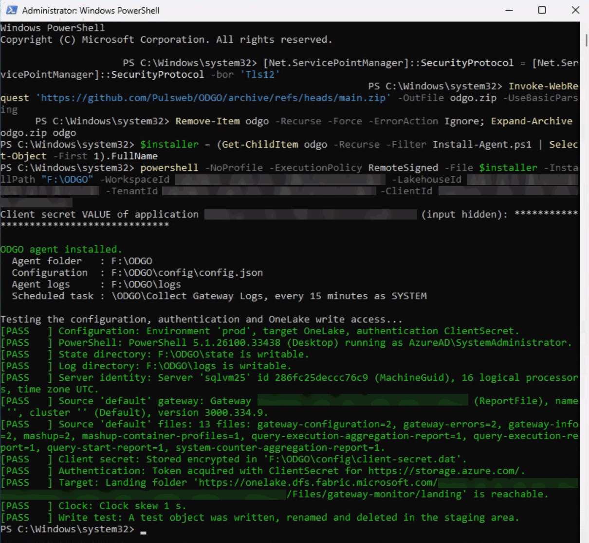
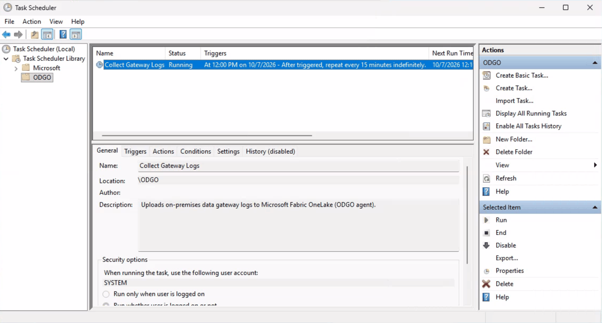

# Setup

ODGO is installed in four steps:

1. [Create an identity for the agents](#1-create-an-identity-for-the-agents) in Microsoft Entra ID.
2. [Give it access to the workspace](#2-give-the-identity-access-to-the-workspace), **before** you run the setup
   notebook.
3. [Run the setup notebook](#3-run-the-setup-notebook) in the workspace.
4. [Install the agent](#4-install-the-agent-on-each-gateway-server) on each gateway server.

Upgrades run steps 3 and 4 again: see [Upgrade](#upgrade).

## Prerequisites

| Where | Requirement |
|---|---|
| Fabric workspace | A workspace assigned to a Fabric capacity (F SKU or trial), preferably used only for ODGO, and the Admin or Member role on it |
| Fabric tenant settings | *Users can access data stored in OneLake with apps external to Fabric* (OneLake settings) and *Service principals can call Fabric public APIs* (Developer settings, on by default). Both can be limited to a security group that contains the agent identity. See [tenant settings](https://learn.microsoft.com/fabric/admin/about-tenant-settings) |
| Gateway servers | Windows with the On-premises data gateway in standard mode, and outbound HTTPS (443) to `login.microsoftonline.com` and `onelake.dfs.fabric.microsoft.com`. Nothing else to install: the agent runs with Windows PowerShell 5.1, built into Windows |
| Reports | The *Logs* page of each report uses the AppSource *Text Filter* visual, which your tenant must allow |

## 1. Create an identity for the agents

**App registration with a client secret** (works on any server):

1. In the [Microsoft Entra admin center](https://entra.microsoft.com), open **App registrations** > **New registration**.
   Name it, for example, `odgo-gateway-agent`, keep *Single tenant* and select **Register**. This also creates its
   *Enterprise application* (service principal), which is what you add to the workspace in step 2. Copy the
   **Application (client) ID** shown on the **Overview** page: you complete the install command with it in step 4.
2. Open **Certificates & secrets** > **New client secret**, choose an expiry and copy the secret **Value** (not the
   *Secret ID*). It's shown only once; you type it on each gateway server in step 4.

No API permission is needed: the agents get access through their workspace role (step 2). One app registration can
serve every gateway server. Plan the secret rotation before it expires (see [Security notes](#security-notes)).

**Managed identity** (no secret): on an Azure VM or an [Azure Arc-enabled server](https://learn.microsoft.com/azure/azure-arc/servers/managed-identity-authentication),
use the server's system-assigned managed identity, which has the server's name. Each server has its own identity.

## 2. Give the identity access to the workspace

Do this **before** you run the setup notebook. The agents need the **Contributor** role on the workspace to write
their logs to the lakehouse.

In the Fabric workspace, select **Manage access** > **Add people or groups**, type the name of the app registration
(for example `odgo-gateway-agent`), select it, choose **Contributor** and select **Add**. With managed identities, add
the identity of each server the same way (it has the server's name), or a security group that contains them.

Contributor is enough. Don't give the agents the Admin or Member role: anyone who holds the client secret could then
manage the access to the workspace.

## 3. Run the setup notebook

1. Download [fabric/ODGO_Setup.ipynb](../fabric/ODGO_Setup.ipynb) (on GitHub, select **Download raw file**).
2. In the Fabric workspace, select **Import** > **Notebook** > **From this computer** and select the file.
3. Open the notebook and select **Run all**. You don't need to change its parameters
   ([configuration.md](configuration.md#setup-notebook-parameters)). In a minute or two the notebook:
   * creates the lakehouse `lh_gateway_monitor` (with schemas);
   * imports the notebooks `nb_gwmon_lib`, `nb_gwmon_ingest` and `nb_gwmon_maintenance`, attached to the lakehouse;
   * creates the *ODGO Model* semantic model (Direct Lake) and two reports on it: *ODGO - Gateway
     Observability*, which opens on a home page with the analysis paths, and *Gateway Monitor*, with the pages of the
     original pbigtwmonitor report;
   * schedules `nb_gwmon_ingest` every 2 hours and `nb_gwmon_maintenance` once a day;
   * starts a first run of `nb_gwmon_ingest`, which continues in the background for a few minutes: it creates the
     tables, the landing folder and `processing.json`, then refreshes the semantic model.
4. The last cell prints the PowerShell lines for step 4, with the IDs of your workspace, lakehouse and tenant.

The notebook downloads the ODGO version set in `source` (by default the `main` branch on GitHub).

## 4. Install the agent on each gateway server

Open PowerShell **as administrator** on the gateway server (Windows PowerShell or PowerShell 7) and paste the lines
printed by the setup notebook, after replacing `<client-id>` with the Application (client) ID of your app registration
(a GUID, not the secret value):

```powershell
Set-Location $env:TEMP
[Net.ServicePointManager]::SecurityProtocol = [Net.ServicePointManager]::SecurityProtocol -bor 'Tls12'
Invoke-WebRequest 'https://github.com/Pulsweb/ODGO/archive/refs/heads/main.zip' -OutFile odgo.zip -UseBasicParsing
Remove-Item odgo -Recurse -Force -ErrorAction Ignore; Expand-Archive odgo.zip odgo
$installer = (Get-ChildItem odgo -Recurse -Filter Install-Agent.ps1 | Select-Object -First 1).FullName
powershell -NoProfile -ExecutionPolicy RemoteSigned -File $installer -InstallPath "$env:ProgramFiles\ODGO" -WorkspaceId <workspace-id> -LakehouseId <lakehouse-id> -TenantId <tenant-id> -ClientId <client-id>
```

The second line turns on TLS 1.2 for the download, which GitHub requires and older Windows versions don't offer by
default. `-InstallPath` is the folder of the agent, its configuration, client secret, state and logs: change it to
install the agent elsewhere, for example `D:\ODGO`. Use a new or empty local folder, not the root of a drive or a
network path.

You're prompted for the client secret value (input hidden). With a managed identity, replace `-TenantId … -ClientId …`
with `-ManagedIdentity` (the notebook prints that line too).

The installer:

* creates the `-InstallPath` folder, which only SYSTEM and Administrators can open because the agent runs as SYSTEM
  and the folder holds the client secret, and copies the agent into it;
* writes `config\config.json` in this folder and stores the client secret encrypted with DPAPI next to it. The agent
  keeps its state in the `state` subfolder and writes its logs in the `logs` subfolder;
* registers the scheduled task `\ODGO\Collect Gateway Logs`, which runs the agent with Windows PowerShell every 15
  minutes as SYSTEM, the first time a few minutes after the installation;
* tests the configuration, gateway discovery, authentication and write access to OneLake. Each check prints *PASS*,
  *WARNING* or *FAIL*, with a fix for each warning or failure.



Optional parameters: `-ProxyUrl` (outbound proxy), `-IntervalMinutes`, `-TaskUser` (a group managed service account
instead of SYSTEM) and `-SkipTest`. Run `Get-Help $installer -Detailed` for details.

**Server without internet access:** download the zip on another computer, copy it to the server, extract it, unblock
the files (`Get-ChildItem -Recurse | Unblock-File`) and run `gateway-agent\Install-Agent.ps1` as administrator with the
same parameters. The server still needs HTTPS access to Microsoft Entra ID and OneLake, directly or through
`-ProxyUrl`.

**Check the scheduled task:** open **Task Scheduler** > **Task Scheduler Library** > **ODGO**. The task *Collect
Gateway Logs* runs as SYSTEM, and its trigger repeats every 15 minutes. After its first run, the **Last Run Result**
column shows *The operation completed successfully. (0x0)*. Other values are agent exit codes: `1` partially
succeeded (the next run continues), `2` failed, `3` configuration error, `4` another run is still in progress; the
agent log in the `logs` subfolder has the details.



**Change the interval:** edit the trigger (**Triggers** > **Edit** > **Repeat task every**) or run
`powershell -ExecutionPolicy RemoteSigned -File "$env:ProgramFiles\ODGO\Install-Agent.ps1" -IntervalMinutes 30` (with
your agent folder). Upgrades keep the interval. Keep it at 60 minutes or less: otherwise the reports can show the
server as *Late*.

**See the first data:** the server appears on the *Ingestion Health* page of the reports after the next
`nb_gwmon_ingest` run, within 2 hours by default. To check the whole chain and see the data right away:

1. On the gateway server, in Task Scheduler, select the *Collect Gateway Logs* task, then **Run** under **Selected
   Item** in the **Actions** pane (or run `Start-ScheduledTask -TaskPath '\ODGO\' -TaskName 'Collect Gateway Logs'`
   as administrator). The first run uploads the log files written in the last 7 days, which can take a few minutes.
   Refresh the list (F5): when the task is back to *Ready*, its **Last Run Result** is *The operation completed
   successfully. (0x0)*.
2. In the Fabric workspace, open the `nb_gwmon_ingest` notebook and select **Run all**. It processes the uploads in a
   few minutes, then refreshes the semantic model.
3. Open the *ODGO - Gateway Observability* report, or select **Refresh** if it's already open: the server appears on
   the *Ingestion Health* page, and the other pages show the data of its gateway.

## Upgrade

1. Run the setup notebook again. It downloads the version set in `source` and updates the items in place; data is
   kept, and a semantic model named *Gateway Monitor* by an earlier version is renamed *ODGO Model*. If the output
   asks you to import a newer setup notebook, or if it stops because the download doesn't look like an ODGO
   repository, delete the notebook, import the latest [fabric/ODGO_Setup.ipynb](../fabric/ODGO_Setup.ipynb) and run
   it.
2. On each gateway server, open PowerShell as administrator and run the `Install-Agent.ps1` of the new version
   without parameters: the download lines of step 4, then
   `powershell -NoProfile -ExecutionPolicy RemoteSigned -File $installer`. It finds the existing installation,
   replaces the agent files in its folder and keeps the configuration, secret, state and scheduled task. A scheduled
   task that an earlier version set up with PowerShell 7 switches to Windows PowerShell: PowerShell 7 isn't needed
   anymore.

## Uninstall

* Agent: run `Uninstall-Agent.ps1` from the agent folder, for example
  `powershell -ExecutionPolicy RemoteSigned -File "$env:ProgramFiles\ODGO\Uninstall-Agent.ps1"`. It removes the
  scheduled task and the agent files, and keeps the configuration, secret, state and logs. Add `-RemoveData` to delete
  the whole folder.
* Fabric: delete the ODGO items, or the workspace.

## Security notes

* **Workspace role.** The agent identity is a Contributor of the workspace: it can write the landing folder, and it
  can also read the processed data and change the items of this workspace. Use a workspace dedicated to ODGO.
* **Agent folder.** The scheduled task runs the agent as SYSTEM and the folder holds the client secret, so only
  SYSTEM, Administrators and the task identity can open the `-InstallPath` folder. The installer refuses a folder
  created by another account or containing other files, so that nobody else can place code that would run as SYSTEM
  or read the secret.
* **Client secret.** The secret is encrypted with DPAPI (machine scope) in a file that only SYSTEM, Administrators and
  the task identity can read, so any administrator of the server can decrypt it. The agent never passes the secret or
  a token to a command as text, so PowerShell module logging doesn't record them. Prefer a managed identity on Azure
  VMs and Azure Arc-enabled servers. Give the secret a limited lifetime and rotate it with
  `Install-Agent.ps1 -UpdateSecret`.
* **Network.** The agent only connects to Microsoft Entra ID (client secret) and OneLake, over HTTPS. A managed
  identity gets its token from a local endpoint: `169.254.169.254` on Azure VMs, `localhost:40342` on Azure Arc.
* **Collected data.** Gateway logs can contain query text, data source names and account names. See
  [Security and privacy](../README.md#security-and-privacy) in the README.
